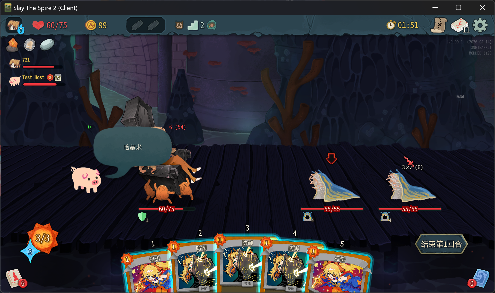
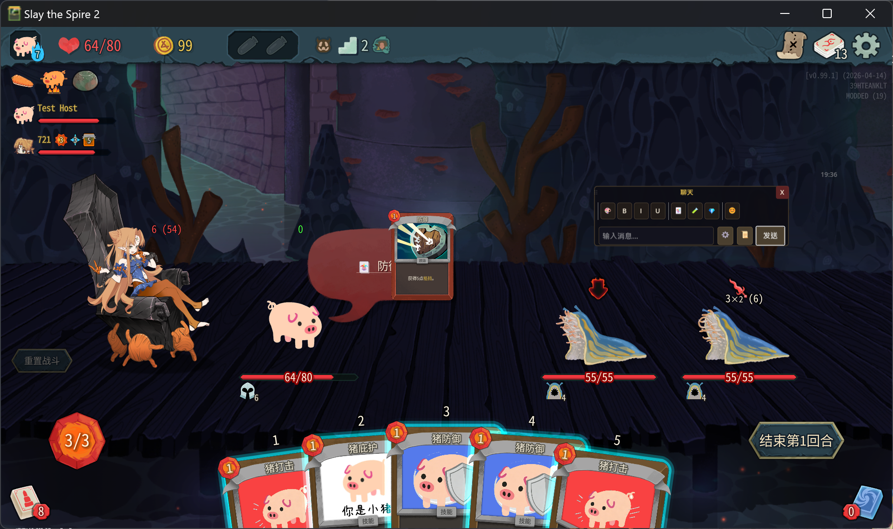
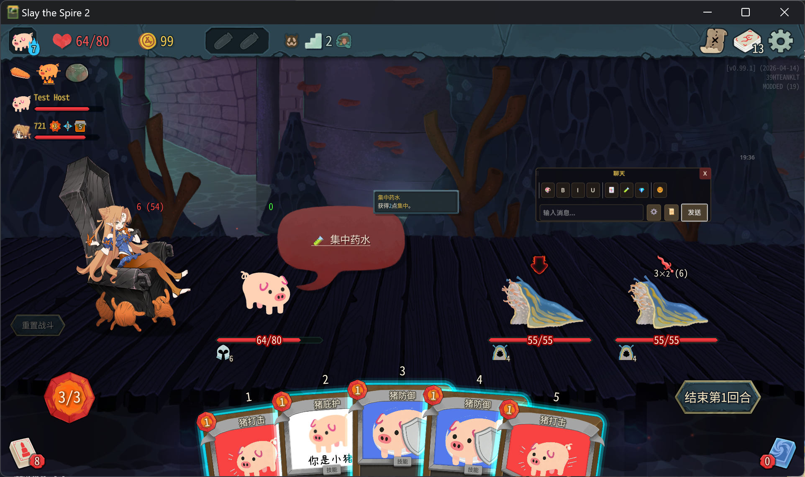
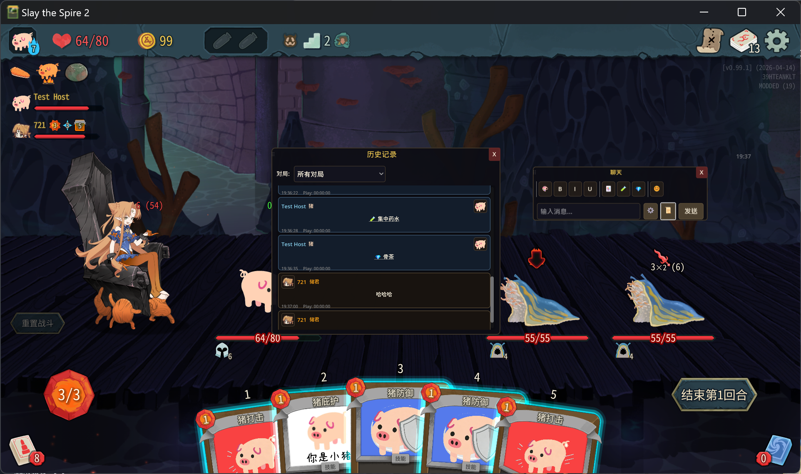
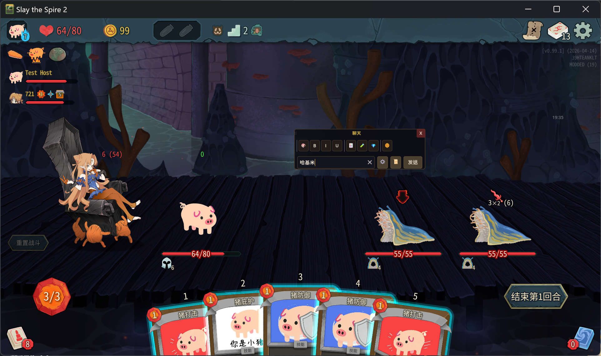
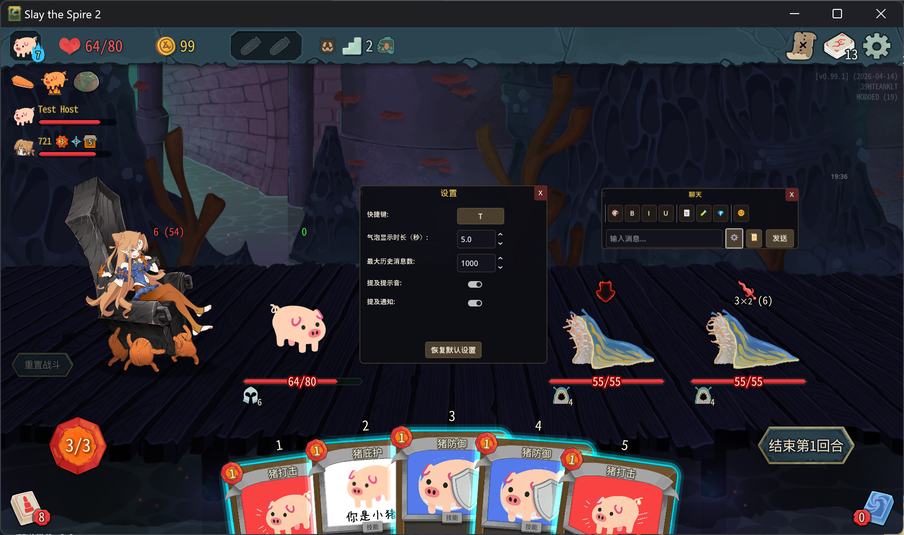

 
   

  <h1>ChatQAQ</h1> 
  
<em>qaq</em>
 
  
  
 
    <a href="#中文">中文</a> | <a href="#english">English</a> 
  
 

   

 

---

## 中文

**ChatQAQ** 是一个为《杀戮尖塔 2》(Slay the Spire 2) 设计的多人聊天模组，让玩家可以在游戏过程中进行实时交流。

### 主要功能

- 💬 **实时聊天** - 在游戏内发送和接收消息，支持多人联机
- 🎈 **聊天气泡** - 消息以气泡形式在角色头顶显示，沉浸感十足
- 📜 **历史记录** - 完整的聊天记录管理，支持查看历史消息
- ⌨️ **快捷键支持** - 自定义快捷键快速打开/关闭聊天输入框
- 🔔 **提及通知** - 当被其他玩家提及时发出通知和提示音
- 🎨 **可定制 UI** - 支持自定义聊天框位置和显示时长

### 安装方法

1. 下载模组 [Release](https://github.com/YuWan886/Sts2-ChatQAQ/releases/latest) | [NexusMods](https://www.nexusmods.com/games/slaythespire2/mods/529) | [备用下载](https://pan.quark.cn/s/4a8dd2826230)
2. 将模组文件解压后放入游戏的 `mods` 文件夹
3. 在游戏中按 `T` 键（默认）打开聊天框

### 使用说明

- **T 键** - 打开/关闭聊天输入框
- **发送消息** - 输入内容后按回车
- **提及玩家** - 使用 @玩家名 格式提及他人

---

## English

**ChatQAQ** is a multiplayer chat mod designed for *Slay the Spire 2*, enabling real-time communication between players during gameplay.

### Key Features

- 💬 **Real-time Chat** - Send and receive messages in-game with multiplayer support
- 🎈 **Speech Bubbles** - Messages display as bubbles above characters for immersive experience
- 📜 **History Management** - Complete chat history with message retrieval
- ⌨️ **Hotkey Support** - Customizable hotkeys to quickly toggle chat input
- 🔔 **Mention Notifications** - Audio and visual notifications when mentioned by other players
- 🎨 **Customizable UI** - Adjustable chat box position and display duration

### Installation

1. Download the mod [Release](https://github.com/YuWan886/Sts2-ChatQAQ/releases/latest) | [NexusMods](https://www.nexusmods.com/games/slaythespire2/mods/529) | [备用下载](https://pan.quark.cn/s/4a8dd2826230)
2. Extract the mod files and place them in the game's `mods` folder.
3. Press `T` (default) in-game to open the chat box

### Usage

- **T Key** - Toggle chat input box
- **Send Message** - Type content and press Enter
- **Mention Players** - Use @PlayerName format to mention others

---

  
  
<b>聊天界面</b>

  
  
<b>卡片</b>

  
  
<b>药水</b>

  
  
<b>遗物</b>

  
  
<b>历史记录</b>

  
  
<b>输入框</b>

  
  
<b>设置</b>

---

模组图标的猪猪：[**YuWanCard**](https://github.com/YuWan886/Sts2-YuWanCard)
截图中使用的储君皮肤：[**Mesugaki Regent**](https://www.nexusmods.com/slaythespire2/mods/502)
